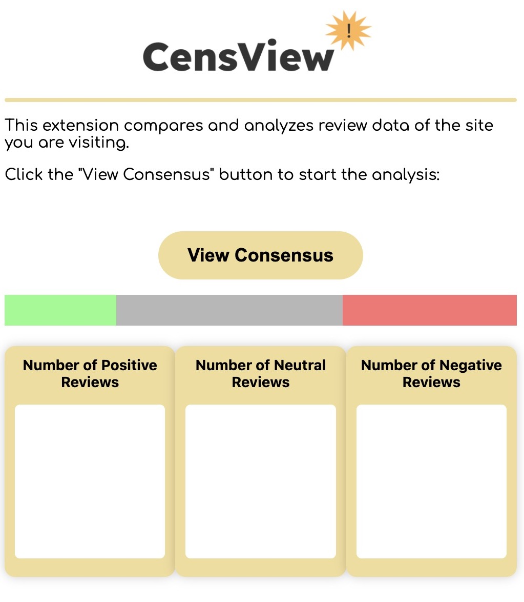

# uOttaHack-5-CensView
<hr>

### Finds the consensus of reviews of different products



## Inspiration
Choosing which product to buy shouldn't be hard. After having bought multiple products online with "high" ratings only to be disappointed. We decide to make an app that helps shoppers make a more informed decisions.

## What it does
CensView is a Chrome extension that condenses and summarizes customer reviews of a product page. Using Cohere's NLP, the app gathers the general consensus of the reviews to help customers make a more informed decision.

## How we built it
The frontend is built using HTML, CSS, and JavaScript. The backend is coded in Python and Javascript, it receives the product URL, scraps the review data from the product site with Puppeteer, and uses Cohere's NLP to analyze the data. Communication between front and back is handled using ExpressJS and Flask.

## Challenges we ran into
- Communicating between frontend and backend. 
- GET and POST requests 
- Finding selectors for Puppeteer

## Accomplishments that we're proud of
- Created a working application
- Support for BestBuy and Amazon
- Teamwork

## What we learned
- Creating chrome extensions
- Working with Cohere
- Full Stack Web Development 

## What's next for CensView
- Adding support for more storefronts
- Hosting the server for the extension online
- Improving the UI look

## Running the Extension
You'll need two seperate terminal windows (terminal1 & terminal2)
1. Clone repository from GitHub
2. Run `npm install` in terminal1
3. Create environment
   - Mac - run `python3 -m venv venv` in terminal2
   - Windows - run `py -3 -m venv venv` in terminal2
4. Activate enivronment
    - Mac - run `. venv/bin/activate` in terminal2
    - Windows - run `venv\Scripts\activate` in terminal2
5. Run the following pip installs in terminal2
```
pip install Flask
pip install cohere
```
6. Create a file with your Cohere API token called `dumby.py`. The contents of the file should look like below:
```python
token = 'API_TOKEN'
```
7. In terminal2 window run `flask --app app run`
8. In terminal1 window run `node app`
9. Can send a GET request to flask for array result, sample results below

Example GET Requests
- `http://127.0.0.1:5000?siteurl=https://www.bestbuy.ca/en-ca/product/sonos-arc-sound-bar-black/14597172&website=bestbuy`
- `http://127.0.0.1:5000?siteurl=https://www.amazon.ca/dp/B09F1QQZM2&website=amazon`